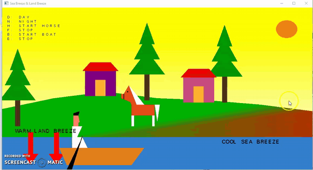

# 2D-CG-Project-Land-Sea-Breeze
Demonstration of land &amp; sea breeze during day and its reversal at night. During day warm air blows from land to sea and cool air from sea to land. It is reversed at night.

Language: C++ using OpenGL/GLUT

## Executing in Visual Studio 2019

### Step 1:
* Extract the contents of the zip file [Glew and Glut](https://github.com/SoniaStalance/Mid-Point-Circle-Algorithm/blob/master/Glew%20and%20Glut.zip) to lets say **Desktop**
* Create new Visual C++ Empty Project lets say **Project1**
* Create new C++ file within your project
* Paste code in the created C++ file

### Step 2:
* Right click on Project1 > Properties > C/C++ > Additional Include Directories > Click on the dropdown box
* Click on edit > folder icon > Desktop > Glew and Glut > freeglut > include
* Then do the same and include Glew and Glut > glew-1.11.0 > include
* Click OK
 
### Step 3:
* Linker > Input > Additional Dependancies > Click on the dropdown box
* Click on edit then type these two filenames
   * freeglut.lib
   * glew32.lib
* Click OK

* Linker > General > Additional Library Dictionarries > Click on the dropdown box
* Click on edit > folder icon > Desktop > Glew and Glut > freeglut > lib
* Then do the same and include Glew and Glut > glew-1.11.0 > lib
* Click OK
* Apply > OK
 
 ### Step 4:
* Copy the following files Desktop > Glew and Glut > freeglut.dll glew32.dll
* Then right click on Project1 > Open Folder in File Explorer
* Paste the copied files
 
 ### Step 5:
 * Click on Local Windows Debugger to run the program
